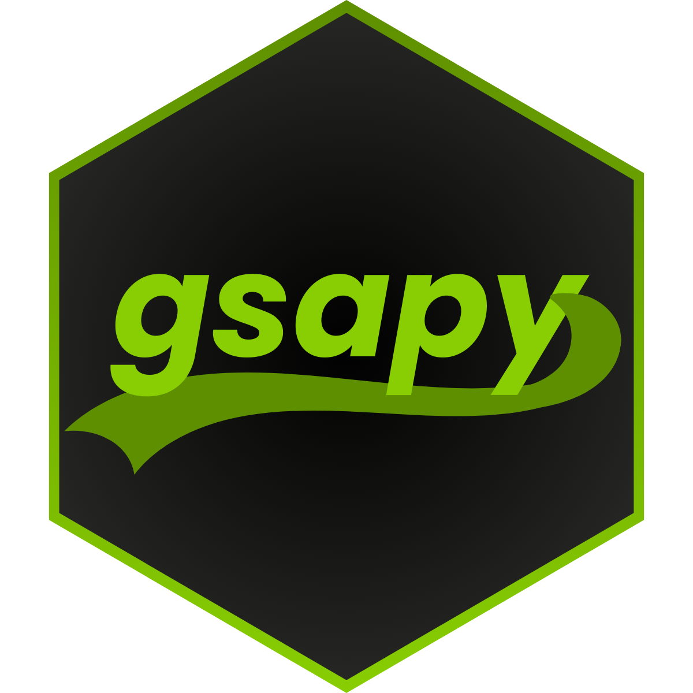

<!-- badges: start -->
[](https://lifecycle.r-lib.org/articles/stages.html#experimental)
<!-- badges: end -->

> [!WARNING]
> The gsapy package is in its initial stages and is subject to change. Things may not work as expected or at all, and things may break in the future.


# gsapy 

R Shiny interface for GSAP – wildly robust JavaScript animations ✨

Do you want to create awesome UI and UX animations in your Shiny applications without understanding timelines, tweens, or writing any JavaScript for that matter? Hey, `gsapy` 👋!
This package provides a simple and elegant way to integrate GSAP (GreenSock Animation Platform) animations into your Shiny apps.

# Installation

You can install the development version of `gsapy` from GitHub with:

```r
devtools::install_github("hypebright/gsapy")
```

# Animations

With `gsapy` you can bring GSAP animations to your Shiny elements without any JavaScript knowledge. The aim is to provide an R interface for common and simple GSAP animations. Currently we support the following animations:

| Animation | Trigger | Plugin | Description |
| --- | --- | --- | --- |
| `fadeIn` | Scroll down/up | ScrollTrigger | Fade in/out elements |
| `zoomIn` | Scroll down/up | ScrollTrigger | Zoom in/out elements |
| `slideIn` | Scroll down/up | ScrollTrigger | Slide in/out elements |
| `stack` | Scroll down/up | ScrollTrigger | Stack elements |
| `waveText` | Page load or event | SplitText | Reveal text with wave effect |
| `fadeInText` | Page load or event | SplitText | Fade in text |
| `flipInText` | Page load or event | SplitText | Flip in text by rotation |


What can you expect in the future?

* Animations with different triggers: on click, hover and possibly other events
* More animations, like carousel, parallax, and anything else that seems fun
* Animations with other (freely available) GSAP plugins
* For more tailored/advanced animations: defining your own tweens and timelines using JS

# Using gsapy

To add an animation, you can call `withGsapy` in your Shiny UI. This function takes an `element`, or a tagList of elements, and an `animation` argument. Here's an example of how you can use `gsapy` to animate multiple `div` elements with the `fadeIn` animation:

```r
library(shiny)
library(bslib)
library(gsapy)

ui <- page_fillable(
  title = "gsap scroll adventures",
  withGsapy(
    id = "divs",
    animation = "fadeIn",
    lapply(1:10, function(i) {
      # simple div with header and random image
      div(
        h3(paste0("Beatiful image ", i)),
        img(src = paste0("https://picsum.photos/600/300?random=", i))
      )
    })
  )
)

server <- function(input, output, session) {}

shinyApp(ui, server)
```

Updating from the server side is also possible by using the `id` argument:

```r
library(shiny)
library(bslib)
library(gsapy)

ui <- page_fillable(
  title = "gsap scroll adventures",
  # animation options
  selectInput("animation", "Choose animation",
              choices = c("fadeIn", "zoomIn", "stack", "slideIn"),
              selected = "fadeIn"),
  withGsapy(
    id = "divs",
    animation = "fadeIn",
    lapply(1:10, function(i) {
      # simple div with header and random image
      div(
        h3(paste0("Beatiful image ", i)),
        img(src = paste0("https://picsum.photos/600/300?random=", i))
      )
    })
  )
)

server <- function(input, output, session) {

  observe({
    updateGsapy("divs", input$animation)
  }) |> bindEvent(input$animation, ignoreInit = TRUE)

}

shinyApp(ui, server)
```

In the above examples we work with plain divs, but you can also apply animations to other elements like `card` from `blisb`. A complete demo can be found in `inst/examples/01-gsapy-scrolltrigger-cards.R`.

Besides animating divs, you can also animate text. For example, you can use the `waveText` animation to create a wave effect on the text. Here's an example of how to use those text animations:

```r
library(shiny)
library(bslib)
library(gsapy)

ui <- page_fillable(
  title = "GSAP text adventures",
  # animation options
  layout_column_wrap(
    width = 1/2,
    max_height = "50px",
    selectInput("animation", "Choose animation",
                choices = c("waveText", "fadeInText", "flipInText"),
                selected = "waveText"),
    tagAppendAttributes(
      style = "margin-top: 25px",
      actionButton("run_again", "Run again")
    )
  ),
  withGsapy(
    id = "paragraphs",
    animation = "waveText",
    # random text paragraph with heading
    div(
      h2("Paragraph 1"),
      p("Lorem ipsum dolor sit amet, consectetur adipiscing elit. Sed do eiusmod tempor incididunt ut labore et dolore magna aliqua.
        Ut enim ad minim veniam, quis nostrud exercitation ullamco laboris nisi ut aliquip ex ea commodo consequat.
        Duis aute irure dolor in reprehenderit in voluptate velit esse cillum dolore eu fugiat nulla pariatur.
        Excepteur sint occaecat cupidatat non proident, sunt in culpa qui officia deserunt mollit anim id est laborum.")
    ),
  ),
  p("Other content")
)

server <- function(input, output, session) {

  observe({
    updateGsapy("paragraphs", input$animation)
  }) |> bindEvent(input$run_again, ignoreInit = TRUE)

}

shinyApp(ui, server)
```


# Licensing
This R package provides an R interface to [GSAP (GreenSock Animation Platform)](https://github.com/greensock/GSAP). The package itself is licensed under the MIT License, meaning you are free to use, modify, and distribute it under permissive terms.

In October 2024, GSAP got acquired by [Webflow](https://webflow.com/), a popular web design platform. Despite the acquisition, GSAP will continue to be publicly available for all developers, and the GSAP team will continue to maintain and improve the library. The aim is that GSAP continues to be the go-to toolset for web animators everywhere.
And it even got better... As of GSAP version 3.13, released in April 2025, there have been significant changes to the licensing model.
**GSAP is now 100% FREE** including the bonus plugins like SplitText, MorphSVG, and all the others that were exclusively available to Club GSAP members, even for commercial use! 🥳 The license used is the standard "No Charge" license. For more information you can check out
the [announcement](https://gsap.com/blog/3-13/?__s=8m3ouioiaxbfmo26ny5o) and new [licensing page](https://gsap.com/community/standard-license/).

This means: unlimited GSAP powered animations in your website or app! And for `gsapy` this means that we can use all the GSAP plugins without any restrictions. So expect more animations in the future! 🎉


